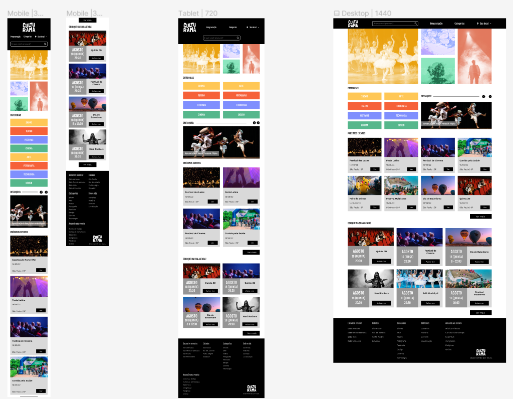

# CULTURAMA - projeto fictício sem fins comerciais

Um projeto responsivo praticando com Flexbox e Grid, com base no mobile-first

- alinhamentos e espaçamentos com Flexbox e Grid
- templates por meio das áreas do Grid
- alteração de eixos com Flexbox

  
...a parte de HTML já foi desenvolvida...

#### Desenvolvido por:

## Anastasiia De Oliveira

#### Linkedin: [anastasiia-de-oliveira](https://www.linkedin.com/in/anastasiia-de-oliveira-237686264/)
  
